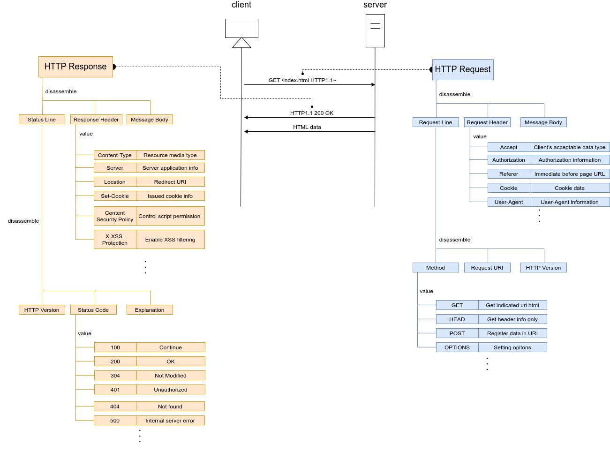

# HTTPの基礎
HTTPのリクエストおよびレスポンスのパケット構造を以下に示す。  

  

## HTTPリクエスト
HTTPリクエストはリクエストライン、リクエストヘッダ、リクエストボディの3つの領域に分けられる。  
### リクエストライン
リクエストラインは、さらにメソッド、リクエストURI、HTTPバージョン3つの情報に分割できる。メソッドはリクエストで何をしたいのか、目的のアクションを指定する場所である。代表的なものはhtmlを取得するGET、データをWebサーバに格納する際に使用するPOSTなどがある。よく言われるGETとPOSTの違いは[下](./README.md#GETとPOSTの違い)に記載している。  
### リクエストヘッダ
リクエストヘッダにはWebページに応じたフィールドの情報が格納される。User-AgentやCookieの情報もここに格納される。Basic認証／Digest認証の認証情報もリクエストヘッダのAuthorizationフィールドに格納されてWebサーバに送られることになる。Basic認証のパケット構造は後述する。
### リクエストボディ
主にPOSTメソッドでデータを格納する際に、格納するデータが記載される。  

HTTPリクエストの通信をキャプチャしたものを以下に示す。

## HTTPレスポンス
HTTPレスポンスはステータスライン、レスポンスヘッダー、メッセージボディの3つの領域に分けられる。
### ステータスライン
ステータスラインは、更にHTTPバージョン、ステータスコード、説明の3つに分割できる。この内、ステータスコードはサーバの状況を示す。100番台は正常に処理中、200番台は正常に受理したことを示す。300番台はリクエストの完了に追加処理が必要なもの、400番台は間違ったリクエストなどにより処理できないもの、500番台はサーバのエラーを示す。

### レスポンスヘッダー
レスポンスヘッダには必要に応じた情報が格納される。Cookie情報もここに格納され、その他セキュリティ設定もこの領域で設定される。

### リクエストボディ
クライアントに返すhtmlが格納される。

## GETメソッドとPOSTメソッドの違い
この2つのメソッドは、やっていることは似ているが目的が異なる。
- GETメソッド：Webサーバからリソースを取り出す
- POSTメソッド：情報をWebサーバに送ってリソースを変更する

GETメソッドでもサーバに情報を送ることができる。ただし、GETメソッドの目的を考慮すると、特定のリソース（html）を取り出すために情報を送ると考えるべきだ。例えば、検索フォームの文字列や表示したいサイトのページIDなど。そのため、目的とは異なるデータ送信はGETメソッドで実施するべきではない。ログインフォームや申し込みフォームの内容がそれに該当する。特に個人情報などの機密情報をGETメソッドで送信する場合はセキュリティ的な問題となる。GETメソッドにおける送信する文字列はリクエストライン内のリクエストURIの後にパラメータとして付与される。これらの情報はアクセスログ等に規則される可能性があり、機密情報の漏洩につながる。POSTメソッドでは送信情報はHTTPボディに格納されるため、GETメソッドのようなセキュリティリスクは軽減できる。  
POSTメソッドのメリットとしてはセキュリティ的な問題以外にも、情報の文字数制限がないことが挙げられる。GETメソッドは情報がブラウザで設定されたURI文字数制限に引っかかる可能性が考えられる。  
GETメソッドのメリットとしては、URIの形式で情報を保持できることが挙げられる。例えばURIにパラメータを含んだ状態で保存しておくことで、そのURIをブラウザに入力することでいつでもパラメータ通りの入力を手軽に行える。

## Basic認証／Digest認証

## Cookie構造

### 参考サイト
https://medium-company.com/http-get-post-%E9%81%95%E3%81%84/  
https://beyondjapan.com/blog/2016/09/different-get-post/  
https://www.websec-room.com/2013/02/24/204  
https://php-junkie.net/beginner/reserved_variables/get_post/