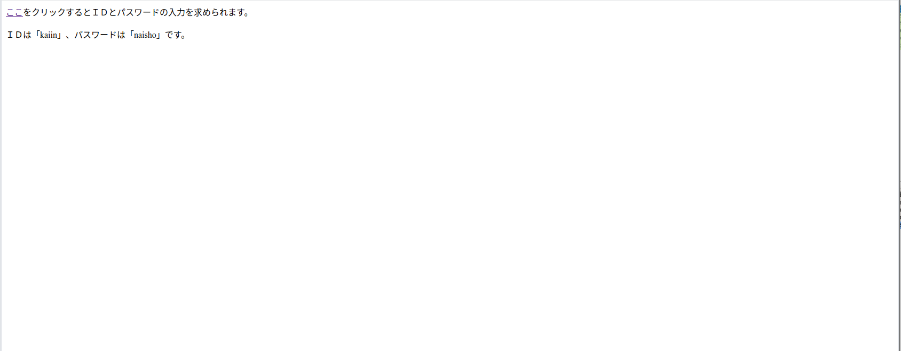
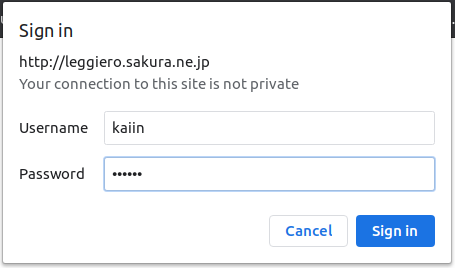
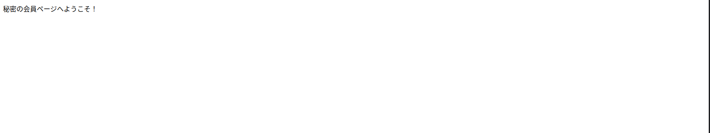

# HTTPの基礎
HTTPのリクエストおよびレスポンスのパケット構造を以下に示す。  

  

## HTTPリクエスト
HTTPリクエストはリクエストライン、リクエストヘッダ、リクエストボディの3つの領域に分けられる。  
### リクエストライン
リクエストラインは、さらにメソッド、リクエストURI、HTTPバージョン3つの情報に分割できる。メソッドはリクエストで何をしたいのか、目的のアクションを指定する場所である。代表的なものはhtmlを取得するGET、データをWebサーバに格納する際に使用するPOSTなどがある。よく言われるGETとPOSTの違いは[下](./README.md#GETとPOSTの違い)に記載している。  
### リクエストヘッダ
リクエストヘッダにはWebページに応じたフィールドの情報が格納される。User-AgentやCookieの情報もここに格納される。Basic認証／Digest認証の認証情報もリクエストヘッダのAuthorizationフィールドに格納されてWebサーバに送られることになる。Basic認証のパケット構造は後述する。
### リクエストボディ
主にPOSTメソッドでデータを格納する際に、格納するデータが記載される。  

HTTPリクエストの通信をキャプチャしたものを以下に示す。


## HTTPレスポンス
HTTPレスポンスはステータスライン、レスポンスヘッダー、メッセージボディの3つの領域に分けられる。
### ステータスライン
ステータスラインは、更にHTTPバージョン、ステータスコード、説明の3つに分割できる。この内、ステータスコードはサーバの状況を示す。100番台は正常に処理中、200番台は正常に受理したことを示す。300番台はリクエストの完了に追加処理が必要なもの、400番台は間違ったリクエストなどにより処理できないもの、500番台はサーバのエラーを示す。

### レスポンスヘッダー
レスポンスヘッダには必要に応じた情報が格納される。Cookie情報もここに格納され、その他セキュリティ設定もこの領域で設定される。

### リクエストボディ
クライアントに返すhtmlが格納される。

## GETメソッドとPOSTメソッドの違い
この2つのメソッドは、やっていることは似ているが目的が異なる。
- GETメソッド：Webサーバからリソースを取り出す
- POSTメソッド：情報をWebサーバに送ってリソースを変更する

GETメソッドでもサーバに情報を送ることができる。ただし、GETメソッドの目的を考慮すると、特定のリソース（html）を取り出すために情報を送ると考えるべきだ。例えば、検索フォームの文字列や表示したいサイトのページIDなど。そのため、目的とは異なるデータ送信はGETメソッドで実施するべきではない。ログインフォームや申し込みフォームの内容がそれに該当する。特に個人情報などの機密情報をGETメソッドで送信する場合はセキュリティ的な問題となる。GETメソッドにおける送信する文字列はリクエストライン内のリクエストURIの後にパラメータとして付与される。これらの情報はアクセスログ等に規則される可能性があり、機密情報の漏洩につながる。POSTメソッドでは送信情報はHTTPボディに格納されるため、GETメソッドのようなセキュリティリスクは軽減できる。  
POSTメソッドのメリットとしてはセキュリティ的な問題以外にも、情報の文字数制限がないことが挙げられる。GETメソッドは情報がブラウザで設定されたURI文字数制限に引っかかる可能性が考えられる。  
GETメソッドのメリットとしては、URIの形式で情報を保持できることが挙げられる。例えばURIにパラメータを含んだ状態で保存しておくことで、そのURIをブラウザに入力することでいつでもパラメータ通りの入力を手軽に行える。


## Basic認証／Digest認証
Basic認証はサーバ側からユーザ名とパスワードをクライアントに要求し、クライアント側でこれらのパラメータを入力しサーバ側に渡す。この時、パスワードを平文で渡すことになるためセキュリティホールとなる。パスワード情報を暗号化する認証方式がDigest認証である。これらはその通信手順から、チャレンジレスポンス方式と呼ばれる。尚、HTTPSでは通信そのものが暗号化されるため、Basic認証の脆弱性を抑えられる。したがって、HTTPS+Basic認証がセキュアかつお手軽な認証方式ということらしい。  
まず、Basic認証のパケットからみていく。[こちらのサイト](http://leggiero.sakura.ne.jp/xxxxbasic_auth_testxxxx/)にアクセスするとBasic認証の流れを確認することができる。Wiresharkを使用して、このサイトとの通信の中身を確認する。アクセス結果は以下の通り。  
    

「ここ」をクリックすると、以下の通りブラウザの認証画面が表示される。  
  

各パラメータに文字を入力すると、以下の画面が表示され認証が成功したことがわかる。  
  


最初にWebサーバにアクセスした際の応答をキャプチャした結果は以下のとおりである。
■ 最初の応答（Webサーバ → クライアント）
```
HTTP/1.1 401 Unauthorized\r\n
    [Expert Info (Chat/Sequence): HTTP/1.1 401 Unauthorized\r\n]
        [HTTP/1.1 401 Unauthorized\r\n]
        [Severity level: Chat]
        [Group: Sequence]
    Response Version: HTTP/1.1
    Status Code: 401
    [Status Code Description: Unauthorized]
    Response Phrase: Unauthorized
Server: nginx\r\n
Date: Mon, 15 Feb 2021 14:14:49 GMT\r\n
Content-Type: text/html; charset=iso-8859-1\r\n
Content-Length: 381\r\n
Connection: keep-alive\r\n
WWW-Authenticate: Basic realm="\203p\203X\203\217\201[\203h\202\360\223\374\202\352\202\304\202\313\201I"\r\n
```
WWW-AuthenticateヘッダでBasic認証を要求していることがわかる。

この応答に対してクライアントから認証情報を送信する。  
■ チャレンジ（クライアント → Webサーバ）
```
GET /xxxxbasic_auth_testxxxx/secret/kaiin_page_top.htm HTTP/1.1\r\n
    [Expert Info (Chat/Sequence): GET /xxxxbasic_auth_testxxxx/secret/kaiin_page_top.htm HTTP/1.1\r\n]
        [GET /xxxxbasic_auth_testxxxx/secret/kaiin_page_top.htm HTTP/1.1\r\n]
        [Severity level: Chat]
        [Group: Sequence]
    Request Method: GET
    Request URI: /xxxxbasic_auth_testxxxx/secret/kaiin_page_top.htm
    Request Version: HTTP/1.1
Host: leggiero.sakura.ne.jp\r\n
Connection: keep-alive\r\n
Cache-Control: max-age=0\r\n
Authorization: Basic a2FpaW46bmFpc2hv\r\n
    Credentials: kaiin:naisho
Upgrade-Insecure-Requests: 1\r\n
User-Agent: Mozilla/5.0 (X11; Linux x86_64) AppleWebKit/537.36 (KHTML, like Gecko) Chrome/87.0.4280.141 Safari/537.36\r\n
Accept: text/html,application/xhtml+xml,application/xml;q=0.9,image/avif,image/webp,image/apng,*/*;q=0.8,application/signed-exchange;v=b3;q=0.9\r\n
Referer: http://leggiero.sakura.ne.jp/xxxxbasic_auth_testxxxx/\r\n
Accept-Encoding: gzip, deflate\r\n
Accept-Language: ja,en-US;q=0.9,en;q=0.8\r\n
```
リクエストヘッダのAuthorizationフィールドに”a2FpaW46bmFpc2hv”が格納されている。これは、ユーザ名とパスワードを併せたもの”kaiin:naisho”をBase64でエンコードしたものである。これを受けて、Webサーバは以下の応答を返す。  
■ レスポンス（Webサーバ → クライアント）
```
HTTP/1.1 200 OK\r\n
    [Expert Info (Chat/Sequence): HTTP/1.1 200 OK\r\n]
        [HTTP/1.1 200 OK\r\n]
        [Severity level: Chat]
        [Group: Sequence]
    Response Version: HTTP/1.1
    Status Code: 200
    [Status Code Description: OK]
    Response Phrase: OK
Server: nginx\r\n
Date: Mon, 15 Feb 2021 14:14:58 GMT\r\n
Content-Type: text/html\r\n
Content-Length: 299\r\n
Connection: keep-alive\r\n
Last-Modified: Fri, 04 Apr 2008 12:15:12 GMT\r\n
ETag: "12b-44a0b11e29400"\r\n
Accept-Ranges: bytes\r\n
```
ステータスコードは”200 OK”となっており、認証に成功したことを示している。  

次に、Digest認証の通信では認証情報がどのように暗号化されるのかを確認する。Digest認証ではテストサイトが見つからなかったため、ローカルにWebサーバを立てて検証した。使用したWebサーバのPHPコードは[こちら](https://www.php.net/manual/ja/features.http-auth.php)から拝借した。
```php
<?php
$realm = 'Restricted area';

//user => password
$users = array('admin' => 'mypass', 'guest' => 'guest');


if (empty($_SERVER['PHP_AUTH_DIGEST'])) {
    header('HTTP/1.1 401 Unauthorized');
    header('WWW-Authenticate: Digest realm="'.$realm.
           '",qop="auth",nonce="'.uniqid().'",opaque="'.md5($realm).'"');

    die('ユーザーがキャンセルボタンを押した時に送信されるテキスト');
}


// PHP_AUTH_DIGEST
if (!($data = http_digest_parse($_SERVER['PHP_AUTH_DIGEST'])) ||
    !isset($users[$data['username']]))
    die('誤った証明書です!');


// 有効なレスポンスを生成する
$A1 = md5($data['username'] . ':' . $realm . ':' . $users[$data['username']]);
$A2 = md5($_SERVER['REQUEST_METHOD'].':'.$data['uri']);
$valid_response = md5($A1.':'.$data['nonce'].':'.$data['nc'].':'.$data['cnonce'].':'.$data['qop'].':'.$A2);

if ($data['response'] != $valid_response)
    die('誤った証明書です!');

// OK, 有効なユーザー名とパスワードだ
echo 'あなたは次のユーザーとしてログインしています: ' . $data['username'];

// http auth ヘッダをパースする関数
function http_digest_parse($txt)
{
    // データが失われている場合への対応
    $needed_parts = array('nonce'=>1, 'nc'=>1, 'cnonce'=>1, 'qop'=>1, 'username'=>1, 'uri'=>1, 'response'=>1);
    $data = array();
    $keys = implode('|', array_keys($needed_parts));

    preg_match_all('@(' . $keys . ')=(?:([\'"])([^\2]+?)\2|([^\s,]+))@', $txt, $matches, PREG_SET_ORDER);

    foreach ($matches as $m) {
        $data[$m[1]] = $m[3] ? $m[3] : $m[4];
        unset($needed_parts[$m[1]]);
    }

    return $needed_parts ? false : $data;
}
```
ブラウザでこのサーバにアクセスすると、Basic認証と同様にブラウザの認証ポップアップが表示され、ユーザ名とパスワードが表示される。今回は正しいユーザ名とパスワードを登録していないため、認証自体には失敗する。まず、最初にサーバにアクセスしたときの応答通信の内容は以下のとおりである。
■ 最初の応答（Webサーバ → クライアント）
```
HTTP/1.1 401 Unauthorized\r\n
    [Expert Info (Chat/Sequence): HTTP/1.1 401 Unauthorized\r\n]
        [HTTP/1.1 401 Unauthorized\r\n]
        [Severity level: Chat]
        [Group: Sequence]
    Response Version: HTTP/1.1
    Status Code: 401
    [Status Code Description: Unauthorized]
    Response Phrase: Unauthorized
Date: Sat, 20 Feb 2021 11:42:26 GMT\r\n
Server: Apache/2.4.6 (CentOS) PHP/5.4.16\r\n
X-Powered-By: PHP/5.4.16\r\n
WWW-Authenticate: Digest realm="Restricted area",qop="auth",nonce="6030f5a2aeb84",opaque="cdce8a5c95a1427d74df7acbf41c9ce0"\r\n
Content-Length: 84\r\n
Keep-Alive: timeout=5, max=100\r\n
Connection: Keep-Alive\r\n
Content-Type: text/html; charset=UTF-8\r\n
```
WWW-AuthenticateでDigest認証を要求している。さらに、ここでrealm,qopなどのパラメータが設定されている。これらの詳細は[こちら](http://www.ric.co.jp/book/pdfs/3-13.pdf)を参照。
クライアントから認証情報を送るチャレンジの通信内容は以下の通り。
■ チャレンジ（クライアント → Webサーバ）
```
GET / HTTP/1.1\r\n
    [Expert Info (Chat/Sequence): GET / HTTP/1.1\r\n]
        [GET / HTTP/1.1\r\n]
        [Severity level: Chat]
        [Group: Sequence]
    Request Method: GET
    Request URI: /
    Request Version: HTTP/1.1
Host: 192.168.3.3\r\n
Connection: keep-alive\r\n
Cache-Control: max-age=0\r\n
Authorization: Digest username="take", realm="Restricted area", nonce="6030f5a2aeb84", uri="/", response="41c38ae7a967a6dafe9f7d5ddf5178d9", opaque="cdce8a5c95a1427d74df7acbf41c9ce0", qop=auth, nc=00000002, cnonce="399dd99abab13a03"\r\n
Upgrade-Insecure-Requests: 1\r\n
User-Agent: Mozilla/5.0 (X11; Linux x86_64) AppleWebKit/537.36 (KHTML, like Gecko) Chrome/87.0.4280.141 Safari/537.36\r\n
Accept: text/html,application/xhtml+xml,application/xml;q=0.9,image/avif,image/webp,image/apng,*/*;q=0.8,application/signed-exchange;v=b3;q=0.9\r\n
Accept-Encoding: gzip, deflate\r\n
Accept-Language: ja\r\n
```
Authorizationにはusernameなどが格納されていることがわかる。responseパラメータが格納されているが、これが認証情報をもとに生成した暗号文である。この暗号文はmd5アルゴリズムを使用し、以下の式で計算される。
> A1 = ユーザ名 ":" realm ":" パスワード   
> A2 = HTTPのメソッド ":" コンテンツのURI  
 cnonce = MD5( MD5(A1) ":" nonce ":" nc ":" cnonce ":" qop ":" MD5(A2) )  
 

## Cookie構造
近日整理予定

### 参考サイト
https://medium-company.com/http-get-post-%E9%81%95%E3%81%84/  
https://beyondjapan.com/blog/2016/09/different-get-post/  
https://www.websec-room.com/2013/02/24/204  
https://php-junkie.net/beginner/reserved_variables/get_post/
https://www.php.net/manual/ja/features.http-auth.php  
http://www.ric.co.jp/book/pdfs/3-13.pdf